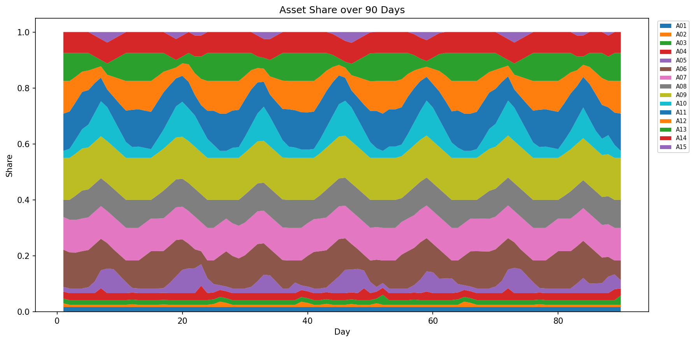
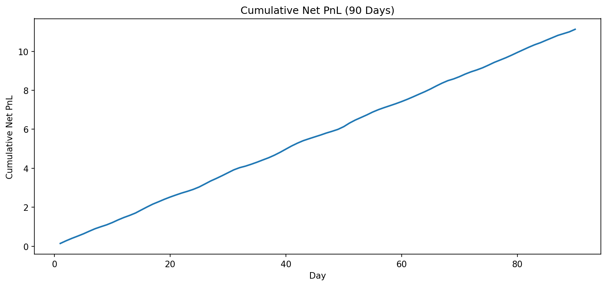
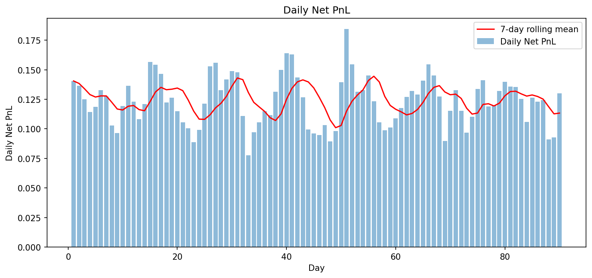

# ALM优化结果报告（管理层版）

## 一、管理层执行摘要
- **求解状态**：OPTIMAL
- **90天累计净收益**：11.130468（目标值 `11.130468101596252`）
- **日均净收益**：0.123672；**区间**：0.077778（D33）~ 0.184506（D51）
- **模型规模**：变量 2250，约束 2857

## 二、关键约束绑定分析（按约束族聚合）
| 约束族 | 绑定频次 | 总频次 | 绑定比例 |
|---|---:|---:|---:|
| c_balance | 90 | 90 | 100.0% |
| c_high_vol_assets_cap | 90 | 90 | 100.0% |
| c_total_assets | 90 | 90 | 100.0% |
| c_duration_exposure | 79 | 90 | 87.8% |
| c_turnover_x | 227 | 1335 | 17.0% |
| c_liquidity_cover | 0 | 90 | 0.0% |
| c_retail_deposit_ratio | 0 | 90 | 0.0% |
| c_single_asset_a15_cap | 0 | 90 | 0.0% |
| c_term_structure_match | 0 | 90 | 0.0% |
| c_turnover_y | 0 | 712 | 0.0% |
| c_wholesale_funding_cap | 0 | 90 | 0.0% |

## 三、资产/负债配置变化原因（自动归因）
- 在高波动利率场景中，组合围绕风险约束边界进行可执行调仓，收益与约束共同塑形。
- 跨日持仓约束限制了单日跳变，保证路径平滑并降低执行冲击。
- 负债端在成本波动下保持结构稳健，优先稳定且成本可控的资金来源。

## 四、下一步策略建议
1. 做关键约束阈值敏感性分析（±5%~15%），评估收益-风险弹性。
2. 对高敏感资产/负债利率路径做情景扰动，输出压力测试对照组。
3. 在周报中持续跟踪“绑定约束榜单 + 收益分解 + 组合迁移图”。

## 五、核心图表

